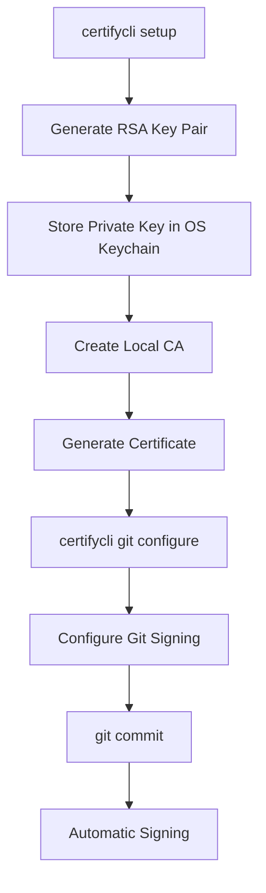

# CertifyCLI 🔐

[](https://golang.org/)
[](https://github.com/CreatorOss/certifycli/releases)
[](https://opensource.org/licenses/MIT)
[](https://github.com/CreatorOss/certifycli/releases)
[](https://github.com/CreatorOss/certifycli/releases)

> Enterprise-grade Git commit signing made simple. No servers, no complexity.

## ✨ Features

- 🚀 **Local First** - No servers required, works completely offline
- 🔐 **Secure by Default** - OS keychain storage, proper certificate management  
- ⚡ **One-Command Setup** - Get started in under 60 seconds
- 🔍 **Comprehensive Verification** - Verify individual commits or entire repositories
- 💼 **Professional Ready** - Perfect for developers, teams, and enterprises

## 🏁 Quick Start

### 📦 Pre-built Binaries (Recommended)

Download for your platform from [Releases Page](https://github.com/CreatorOss/certifycli/releases):

**Linux:**
```bash
# AMD64
wget https://github.com/CreatorOss/certifycli/releases/latest/download/certifycli-linux-amd64
chmod +x certifycli-linux-amd64
sudo mv certifycli-linux-amd64 /usr/local/bin/certifycli

# ARM64 (Raspberry Pi, newer phones)
wget https://github.com/CreatorOss/certifycli/releases/latest/download/certifycli-linux-arm64
chmod +x certifycli-linux-arm64
sudo mv certifycli-linux-arm64 /usr/local/bin/certifycli
```

**macOS:**
```bash
# Intel Macs
curl -L https://github.com/CreatorOss/certifycli/releases/latest/download/certifycli-macos-amd64 -o certifycli
chmod +x certifycli
sudo mv certifycli /usr/local/bin/

# Apple Silicon (M1/M2)
curl -L https://github.com/CreatorOss/certifycli/releases/latest/download/certifycli-macos-arm64 -o certifycli
chmod +x certifycli
sudo mv certifycli /usr/local/bin/
```

**Windows:**
```powershell
# Download certifycli-windows-amd64.exe from releases
# Move to a directory in your PATH
```

### 🛠️ From Source
```bash
go install github.com/CreatorOss/certifycli@latest
```

## 🚀 Basic Usage

```bash
# Setup your identity
certifycli setup

# Configure Git
certifycli git configure

# Start signing commits!
git add .
git commit -m "My securely signed commit"
```

## 📖 Documentation

- [📋 Command Reference](docs/commands.md)
- [🔧 Troubleshooting](docs/troubleshooting.md)
- [🤝 Contributing Guide](CONTRIBUTING.md)

## 🏗️ Architecture

CertifyCLI uses a **local-first architecture**:

- **No Server Dependency**: Works completely offline
- **Local Certificate Authority**: Self-signed certificates for development
- **OS Keychain Integration**: Secure storage using system keychain
- **Git Integration**: GPG-compatible signature format

## 🔒 Security Features

- 🔐 **Private keys stored in OS keychain** (macOS Keychain, Windows Credential Manager, Linux Secret Service)
- 🔐 **No plaintext keys on disk**
- 🏛️ **Local Certificate Authority** (no server required)
- 🔧 **Git commit signing integration**
- 💾 **Backup and restore functionality**

## 🌍 Platform Support

| Platform | Architecture | Status |
|----------|-------------|--------|
| Linux | AMD64 | ✅ Supported |
| Linux | ARM64 | ✅ Supported |
| macOS | Intel | ✅ Supported |
| macOS | Apple Silicon | ✅ Supported |
| Windows | AMD64 | ✅ Supported |

## 🔄 Workflow



## 🤝 Contributing

We welcome contributions! Please see our [Contributing Guide](CONTRIBUTING.md) for details.

### Development Setup

```bash
# Clone repository
git clone https://github.com/CreatorOss/certifycli.git
cd certifycli

# Install dependencies
go mod download

# Build
go build -o certifycli ./cmd/certifycli

# Test
go test ./...
```

## 📜 License

CertifyCLI is dual-licensed:

- **Community Edition**: [MIT License](LICENSE) - Free for personal and open source use
- **Pro Edition**: Commercial License - For professional and enterprise use

## 🆘 Support

- 🐛 [Report Issues](https://github.com/CreatorOss/certifycli/issues)
- 💬 [Join Discussions](https://github.com/CreatorOss/certifycli/discussions)
- 📖 [Check Wiki](https://github.com/CreatorOss/certifycli/wiki)

## 🏷️ Topics

`git` `security` `go` `cli` `signing` `certificates` `cryptography` `developer-tools` `local-first` `offline`

---

<div align="center">
Made with ❤️ by the CertifyCLI Team
</div>